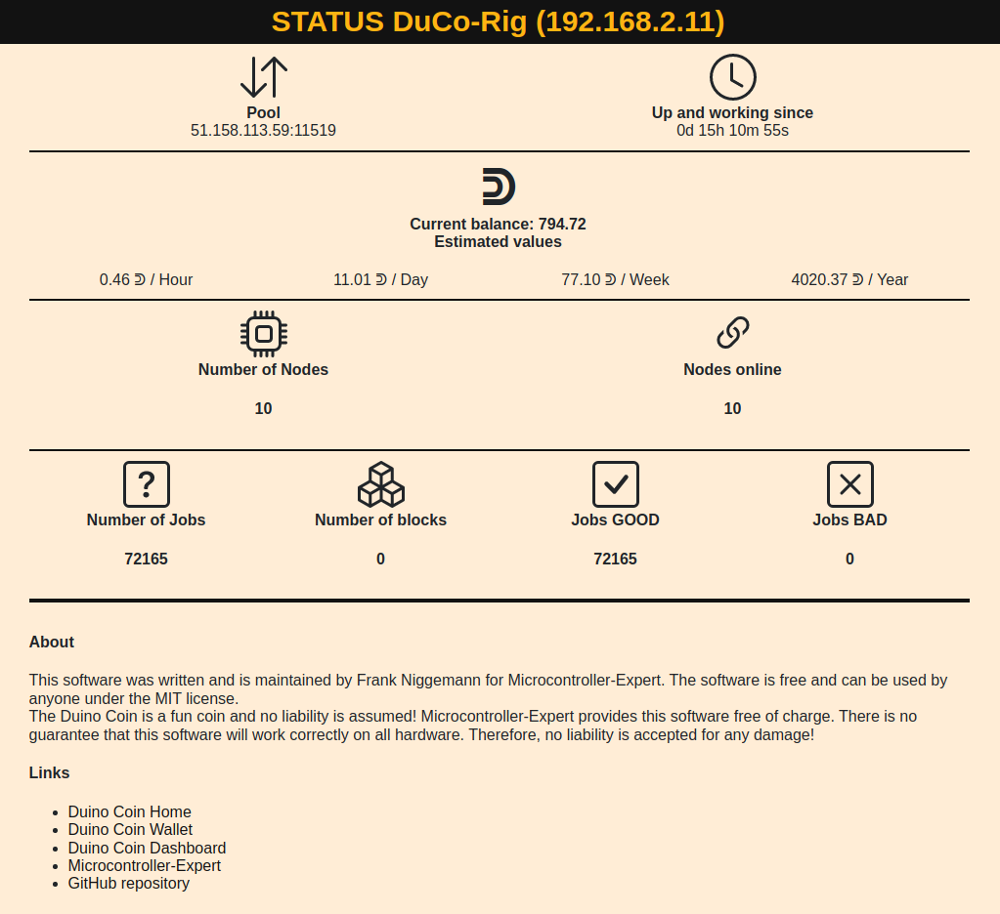
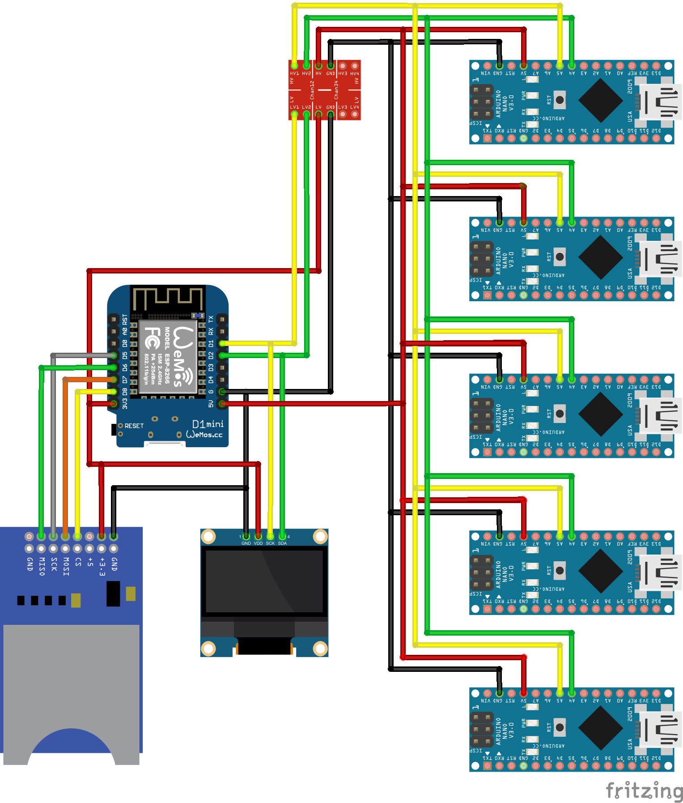
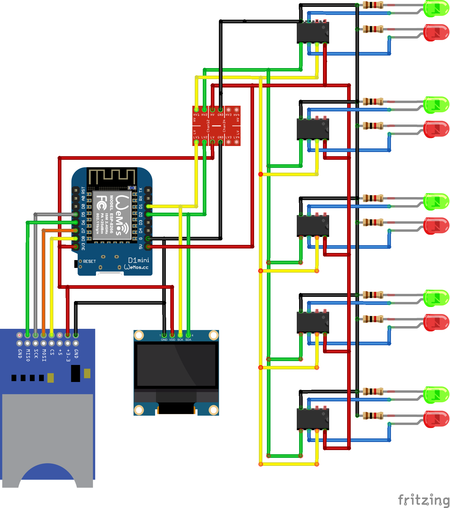

# duino-coin-rig
This will be the official software for the official Duino Coin Rig. This software is currently still in alpha status and is being further developed.

### Table of contents
- [Hardware](#hardware)
  * [Currently supported hardware](#currently-supported-hardware)
  * [Planned additional SBCs](#planned-additional-sbcs)
  * [Plannes additional MCs](#plannes-additional-mcs)
- [Component wiring](#component-wiring)
  * [ESP8266 to Arduino Nano](#esp8266-to-arduino-nano)
  * [ESP8266 to SSD1306 display](#esp8266-to-ssd1306-display)
  * [ESP8266 to SD card](#esp8266-to-sd-card)
    + [3.3V SD card adapter](#33v-sd-card-adapter)
    + [5V SD card adapter](#5v-sd-card-adapter)

### Screenshot Webfrontend



## Hardware
### Currently supported hardware
- ESP8266
- Arduino Nano

### Planned additional SBCs
- ESP32
- Arduino Micro
- Arduino Uno
- Arduino Mega

### Plannes additional MCs
- ATtiny85


## Component wiring

### ESP8266 to Arduino Nano
Tested with ESP8266 D1 Mini, but should theoretically work with ESP8266 NodeMCU as well.

Because the ESP8266 works with a 3.3V signal and the Arduino Nanos need a 5V signal, you have to connect a logic level converter in between. This converts the 3.3V signals from the ESP8266 to 5V for the Arduino Nanos and the 5V signals from the Arduino Nanos to 3.3V for the ESP8266. Without this conversion, the components could not communicate with each other.

| Type | ESP8266 D1 Mini |  ESP8266 NodeMCU | - | Logic Level Converter | - | Arduino Nano |
|:-----:| :-----: | :-----: | :-----: | :-----: | :-----: | :-----: |
| GND | GND | GND | - | GND - GND | - | GND |
| Voltage    | 3.3V | 3.3V | - | 3V - 5V | - | 5V |
| Voltage    | 5V | VIN | - | - | - | 5V |
| SCL | D1 | D1 | - | LV1 - HV1 | - | A5 |
| SDA | D2 | D2 | - | LV2 - HV2 | - | A4 |




### ESP8266 to ATTINY85
Tested with ESP8266 D1 Mini, but should theoretically work with ESP8266 NodeMCU as well.

Because the ESP8266 works with a 3.3V signal and the ATTINYs need a 5V signal, you have to connect a logic level converter in between. This converts the 3.3V signals from the ESP8266 to 5V for the ATTINYs and the 5V signals from the ATTINYs to 3.3V for the ESP8266. Without this conversion, the components could not communicate with each other.

| Type | ESP8266 D1 Mini |  ESP8266 NodeMCU | - | Logic Level Converter | - | ATTINY85 |
|:-----:| :-----: | :-----: | :-----: | :-----: | :-----: | :-----: |
| GND | GND | GND | - | GND - GND | - | PIN4 |
| Voltage    | 3.3V | 3.3V | - | 3V - 5V | - | PIN8 |
| Voltage    | 5V | VIN | - | - | - | PIN8 |
| SCL | D1 | D1 | - | LV1 - HV1 | - | PIN7 |
| SDA | D2 | D2 | - | LV2 - HV2 | - | PIN6 |




### ESP8266 to SSD1306 display
Tested with ESP8266 D1 Mini, but should theoretically work with ESP8266 NodeMCU as well.

The display is connected directly to the ESP8266 because no logic level converter is required.

| Type | ESP8266 D1 Mini |  ESP8266 NodeMCU | SSD1306 |
|:-----:| :-----: | :-----: | :-----: |
| GND | GND | GND | GND |
| Voltage    | 3.3V | 3.3V | VCC |
| SCL | D1 | D1 | SCL |
| SDA | D2 | D2 | SDA |


### ESP8266 to SD card
Tested with ESP8266 D1 Mini, but should theoretically work with ESP8266 NodeMCU as well.

Depending on the SD card adapter, it must be connected to either the 3.3V or the 5V connection of the ESP8266. We present it in two different tables, although all other connections are identical.


#### 3.3V SD card adapter
| Type | ESP8266 D1 Mini |  ESP8266 NodeMCU | 3.3V SD card adapter |
|:-----:| :-----: | :-----: | :-----: |
| GND | GND | GND | GND | GND |
| Voltage    | 3.3V | 3.3V | VCC |
| SCK | D5 | D5 | SCK |
| MISO | D6 | D6 | MISO |
| MOSI | D7 | D7 | MOSI |
| CS | D8 | D8 | CS |


#### 5V SD card adapter
| Type | ESP8266 D1 Mini |  ESP8266 NodeMCU | 5V SD card adapter |
|:-----:| :-----: | :-----: | :-----: |
| GND | GND | GND | GND | GND |
| Voltage    | 5V | VIN | VCC |
| SCK | D5 | D5 | SCK |
| MISO | D6 | D6 | MISO |
| MOSI | D7 | D7 | MOSI |
| CS | D8 | D8 | CS |


## Required Libraries
You need these libraries to be able to compile the code.

- Arduino
- ArduinoJson
- ESP8266HTTPClient
- ESP8266mDNS
- ESP8266WiFi
- ESPAsyncTCP
- ESPAsyncWebServer
- NTPClient
- SdFat
- SPIFFSEditor
- SSD1306Wire
- WiFiClientSecureBearSSL
- WiFiUdp
- Wire

## Configuration
### Configuration without SD card
Without the SD card adapter and a SD card you have to configure this software in the code. To do this, you need to adjust the following variables in the ESP8266_Master file.

| Variable | Description |
|:-----:| :-----: |
| wifiSsid | The SSID (name) of your WiFi network |
| wifiPassword | The password of your WiFi network |
| nameUser | The name you use for your wallet |
| nameRig | The name of your rig |

### Configuration with SD card
If you want to load your configuration from an SD card, you need to create a text file called "config.rig" on the SD card and fill in this information:
```
wifi_ssid={The SSID (name) of your WiFi network}
wifi_password={The password of your WiFi network}
name_user={The name you use for your wallet}
name_rig={The name of your rig}
```

It could then look like this:
```
wifi_ssid=MyHomeWiFi
wifi_password=secret123
name_user=Duinouser
name_rig=Duinorig
```
